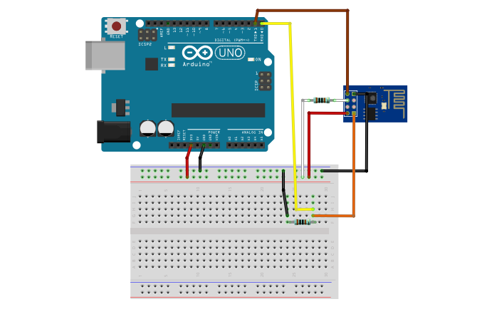

# Comment connecter le gentil ESP à l'internet

Suivre le gentil tuto suivant : https://www.circuitbasics.com/how-to-set-up-a-web-server-using-arduino-and-esp8266-01/

<em><strong>Mais attention ! </strong></em>

On n'est pas bête comme moi et on ne fait pas des c/c des commandes dans le moniteur série de l'arduino ! En effet la mise en page du site fait que le moniteur de reconnaître pas les gentils caractères !

AT

AT+CWMODE?

AT+CWMODE=3

AT+CWLAP

AT+CWJAP="ssid","password"
