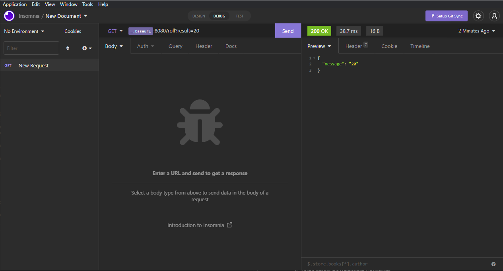

  

# Projet IOT B2Q2

Ce projet rassemble les différents fichiers constituant mon projet d'IOT B2Q2.

#

# Description du projet

J'ai créé un dé 20, qui fonctionne avec un bot discord.

### **Mise en scène ;**

Nous sommes 4 personnes et nous jouons à un jeu de rôles. 3 d'entre nous ont un dé, et le 4eme joueur n'en a pas (parce que c'est long à fabriquer...).

Lorsqu'un joueur "lance" son dé, il voit le résultat dessus, et ce résultat est aussi envoyé sur le channel discord où tous les joueurs sur le channel de la partie peuvent le voir.

Celui qui n'a pas encore son dé peut simplement écrire `/rand` dans le chat discord : cette commande simule un dé, permettant à ceux qui n'ont pas de dé de jouer quand même !
  
#

# Fonctionnement

Le dé est équipé d'un switch ON/OFF permettant de mettre en route l'objet. Une fois sur ON, il cherchera un réseau wifi connu auquel se connecter (s'il n'en trouve pas, il fonctionnera quand même, mais n'enverra pas de message sur discord.)

Lorsque l'on secoue le dé, il génère un nombre random. Ce résultat est affiché sur la matrice de leds lui servant d'écran. Ces deux opérations sont gérées par l'arduino. Ensuite, l'arduino envoie ce résultat à l'ESP. L'ESP va se comporter en tant que client du bot discord. Il envoie le numéro obtenu au bot discord via une requête GET sur la REST API du bot.

Le bot discord est sur un serveur OVH et a une IP dédiée.

Via l'IP on accède au serveur, via le port on accède au service (le backend du bot/serveur), via une route on accède à la logique associée écrite dans le code.

Le bot discord recoit le résultat, et en fait un joli message.

# 

# Améliorations envisageables
 - Une plus jolie boîte
 - Des options : D4, D6, D10
 - une interface pour se connecter au wifi (sans devoir l'hard-coder dans l'ESP)
 - Faire le rand sur le serveur directement pour plus de sécurité (si on a l'IP et la route, on peut faire dire n'importe quoi au bot). On aurait aussi peu authentifier la route avec des credential, mais la meilleure solution aurait été de laisser le serveur faire toute la logique.
 Il faudrait enlever l'argument result = 20.
 
 - Dans le cadre de cette requête, ça devrait être un POST. Mais si on avait fait l'amélioration citée précédement, on aurait pu laisser un GET (puisque ça aurait été l'ESP qui reçevrait une info du serveur(bot))

 #

 # Carnet de bord

* Semaine 28/02 – 06/03 :
    -	Création du bot discord. 
    -	Apprentissage du .js et des commandes de base. 
    -	Le bot répond aux commandes customisées.
    -	Commande /rand qui fait rouler le dé, qui sera remplacée par l’event « le dé est secoué » plus tard. 
        - Il affiche une image d’un dé avec le chiffre obtenu…
        - et cite le pseudo de la personne qui a fait l’action.

* Semaine 07/03 – 13/03 :
    -	Tests matrice 8x8 + arduino
    -	Tests tilt + arduino
    -	Tests tilt + matrice : quand je secoue le tilt, la matrice s’allume
    -	Intégration de patterns  

* Semaine 14/03 – 20/03 :
    -	Ajout du random quand on secoue le prototype
    -	Ajout des patterns qui représentent les chiffres
    -	Vidéo avancement  

* Semaine 28/03 – 03/04 : 
    -	Soudure de l’alim
    -	Intégration de l’alim (pile) au circuit

* Semaine 04/04 - … : 
    -	Recherches ESP

* Semaine 11/04 – 17/04 : 
    -	L’ESP se connecte à internet via les commandes AT

* Semaine 6/06 - 12/06
    -	Le bot répond aux commandes GET d’un client (Commande qui sera envoyée par l’ESP)
    -	Mise en place du Bot discord sur un serveur OVH  

* Semaine 13/06 - 19/06
    - ESP se connecte au partage de connection du téléphone
    - Tentatives vaines d'utiliser l'imprimante 3D pour l'impression de la boîte
    - Tentatives vaines de faire un circuit propre
    - Elaboration de solutions de secours
    - Vidéo avancement n°2